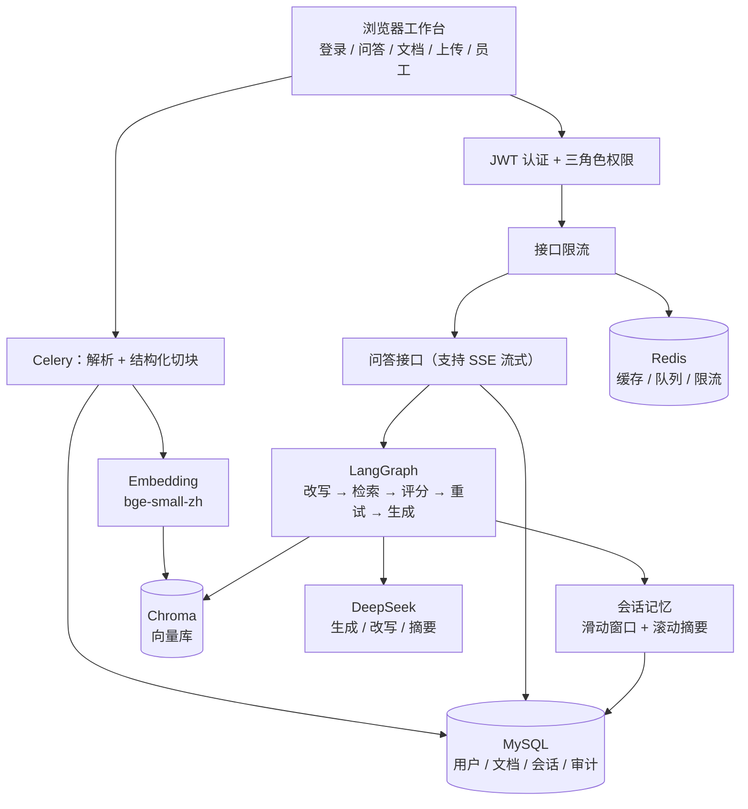

# SmartKBQA — 企业知识库智能问答

[](https://github.com/ZHANGZILONG-long/smart-kbqa-rag/actions/workflows/tests.yml)


基于 Django + DRF + JWT + Celery + Chroma + LangGraph + DeepSeek 的多角色企业知识库问答系统，覆盖三种角色、文档审批、异步入库、多轮记忆与流式问答。

## 系统架构



- **文档入库**：上传 → 解析（PDF / DOCX / TXT）→ 按章节与编号条目结构化切块 → 写入向量库并记录审计；部门文档需总管理员审批后才入库
- **问答链路**：问题 + 对话历史 → 指代消解改写 → 向量检索（多召回后按主题收敛）→ 相关性评分 → 资料不足时换词重试 → 生成回答并引用资料编号 → 落库后异步滚动摘要

## 功能概览

- 认证：注册 / 登录 / JWT / 改密 / 退出
- 角色：总管理员、部门管理员（如研发部/财务部）、普通员工
- 文档：上传、解析分块、向量化、部门可见性、部门上传需总管审批
- 问答：RAG + LangGraph 多步检索、会话历史、SSE 流式输出
- 记忆：多轮对话的上下文管理（滑动窗口 + 滚动摘要 + 指代消解 + 可查看/清空）
- 员工管理：按角色查看/编辑，仅总管可任命管理员
- 安全运维：接口限流、审计日志、健康检查、结构化日志、任务重试与告警 webhook

## 角色说明

| 角色 | 能力 |
|------|------|
| **总管理员** `super_admin` | 全文档、审批、全员员工、任命部门/总管理员、审计日志 |
| **部门管理员** `dept_admin` | 必须绑定部门；上传本部门文档（待审批）；管理本部门普通员工 |
| **普通员工** `user` | 检索全员 + 本部门已入库文档；改密；不可上传/管人 |

## 本地快速启动

### 1. 环境

- Python 3.10+
- MySQL 8（或开发时 `USE_SQLITE=True`）
- Redis（或开发时 `USE_LOCMEM_CACHE=True` + `CELERY_TASK_ALWAYS_EAGER=True`）

```bash
cd smart_kbqa
python -m venv .venv
# Windows: .venv\Scripts\activate
source .venv/bin/activate
pip install -r requirements.txt
cp .env.example .env
# 编辑 .env：DJANGO_SECRET_KEY、数据库、DEEPSEEK_API_KEY 等
python manage.py migrate
python manage.py createsuperuser
python manage.py runserver
```

浏览器打开：http://127.0.0.1:8000/login/

### 2. 运行测试

```bash
python manage.py test accounts documents qa common -v 2
```

测试使用内存 SQLite + LocMem 缓存（`test` 命令自动启用），不依赖 MySQL / Redis，也不会下载 embedding 模型（向量检索与 LLM 调用已 mock）。最近一次结果见页面顶部的 CI 徽章。

### 3. 异步 Worker（可选）

```bash
# .env 中 CELERY_TASK_ALWAYS_EAGER=False
celery -A config worker -l info
```

## Docker Compose 部署

```bash
cp .env.example .env
# 生产务必：DEBUG=False，强密钥，真实 DB 密码，配置 ALLOWED_HOSTS
docker compose up -d --build
```

- 应用入口（Nginx）：http://127.0.0.1:8080/
- 健康检查：`GET /api/health/` 、`GET /api/health/ready/`
- HTTPS：将证书放入 `deploy/certs/`，按 `deploy/nginx.conf` 启用 443，并可设：
  - `SECURE_SSL_REDIRECT=True`
  - `SESSION_COOKIE_SECURE=True`
  - `CSRF_COOKIE_SECURE=True`
  - `SECURE_HSTS_SECONDS=31536000`

### 备份与恢复

```bash
# Linux / macOS / Git Bash
chmod +x scripts/*.sh
./scripts/backup.sh
./scripts/restore.sh backups/YYYYMMDD_HHMMSS

# Windows PowerShell
.\scripts\backup.ps1
```

备份内容：MySQL dump、`media/`、`data/chroma/`。建议配合 cron / 计划任务每日执行。

## 页面路由

| 路径 | 说明 |
|------|------|
| `/login/` `/register/` | 登录注册 |
| `/qa/` | 知识问答（会话历史 + 流式） |
| `/documents/` | 文档列表与审批 |
| `/upload/` | 上传（含进度条） |
| `/staff/` | 员工管理 |
| `/profile/` | 个人信息与改密 |

## 主要 API 清单

### 认证 ` /api/auth/ `

| 方法 | 路径 | 说明 |
|------|------|------|
| POST | `/login/` | 登录，返回 JWT + user |
| POST | `/register/` | 注册普通用户 |
| POST | `/refresh/` | 刷新 token |
| POST | `/logout/` | 拉黑 refresh |
| GET | `/me/` | 当前用户 |
| POST | `/change-password/` | 修改密码 |
| GET | `/departments/` | 部门列表 |
| GET | `/staff/` | 员工列表（管理员） |
| GET/PATCH | `/staff/{id}/` | 员工详情/更新 |

### 文档 ` /api/documents/ `

| 方法 | 路径 | 说明 |
|------|------|------|
| GET/POST | `/` | 列表 / 上传 |
| GET/DELETE | `/{id}/` | 详情 / 删除 |
| POST | `/{id}/reprocess/` | 重处理 |
| POST | `/{id}/approve/` | 审批通过 |
| POST | `/{id}/reject/` | 驳回 |

### 问答 ` /api/qa/ `

| 方法 | 路径 | 说明 |
|------|------|------|
| POST | `/ask/` | 问答；`stream=true` 为 SSE，`use_memory=false` 关闭记忆 |
| GET | `/sessions/` | 会话列表 |
| GET/DELETE | `/sessions/{id}/` | 会话详情/删除 |
| GET/DELETE | `/sessions/{id}/memory/` | 查看/清空会话记忆（`?purge_messages=1` 连消息一起删） |

### 运维 ` /api/ `

| 方法 | 路径 | 说明 |
|------|------|------|
| GET | `/health/` | 存活 |
| GET | `/health/ready/` | DB/缓存就绪 |
| GET | `/audit/` | 审计日志（仅总管理员） |

## 对话记忆（上下文管理）

多轮问答的记忆分三层，全部由 `MEMORY_*` 环境变量控制：

| 层 | 载体 | 作用 |
|----|------|------|
| 短期记忆 | 最近 `MEMORY_WINDOW_TURNS` 轮的原文消息 | 追问、省略、指代能接上上下文 |
| 长期记忆 | `QuestionSession.summary` 滚动摘要 | 更早的对话不丢失，又不挤占 prompt |
| 检索记忆 | 指代消解后的 `search_query` | 把"那它要多久"补全成可独立检索的查询 |

工作方式：

- 组装上下文时从最新消息向前填充，总长度不超过 `MEMORY_MAX_HISTORY_CHARS`；单条超过 `MEMORY_MAX_MESSAGE_CHARS` 先截断，避免一条长回答吃满预算
- 记忆在写入本轮消息**之前**构建，因此历史里不含当前问题，不会自我重复
- 检索改写节点会带上最近对话做指代消解；生成节点把历史作为对话消息插入，事实依据仍只来自本轮检索到的资料
- 回答落库后由 Celery 任务 `qa.tasks.refresh_session_summary` 异步滚动摘要，失败只记日志，不影响问答
- 未配置 `DEEPSEEK_API_KEY` 时，摘要退化为启发式拼接，检索改写退化为"拼接上一轮问题"，功能仍可用
- 请求体传 `use_memory: false` 可对单次提问关闭记忆

响应中的 `memory` 字段给出本次实际用量：

```json
{
  "enabled": true, "turns": 4, "summary_used": true, "summary_chars": 120,
  "history_chars": 860, "budget_chars": 4000, "dropped_messages": 2,
  "memory_used": true, "search_query": "请假审批时效"
}
```

| 环境变量 | 默认 | 说明 |
|----------|------|------|
| `MEMORY_ENABLED` | True | 记忆总开关 |
| `MEMORY_WINDOW_TURNS` | 6 | 进入 prompt 的最近轮数 |
| `MEMORY_MAX_HISTORY_CHARS` | 4000 | 历史消息字符预算 |
| `MEMORY_MAX_MESSAGE_CHARS` | 800 | 单条历史消息长度上限 |
| `MEMORY_SUMMARY_ENABLED` | True | 是否启用滚动摘要 |
| `MEMORY_SUMMARY_MAX_CHARS` | 1200 | 摘要长度上限 |
| `MEMORY_HISTORY_IN_REWRITE` | True | 检索改写是否结合对话历史 |

## 限流（默认）

| 范围 | 速率 |
|------|------|
| 匿名 | 60/min |
| 登录用户 | 300/min |
| 登录/注册 | 20/min |
| 问答 | 30/min |
| 上传 | 20/min |

可通过环境变量 `THROTTLE_*` 调整。

## 日志与告警

- 结构化 JSON 日志：`logs/app.jsonl` + 控制台
- 文档处理失败：写失败状态 + 日志；若配置 `ALERT_WEBHOOK_URL` 则 POST 告警
- Celery 任务最多重试 3 次（非 eager 模式）

## 环境变量要点

见 `.env.example`。生产检查清单：

- [ ] `DEBUG=False`
- [ ] 强 `DJANGO_SECRET_KEY`
- [ ] `ALLOWED_HOSTS` 为真实域名
- [ ] MySQL / Redis 强密码
- [ ] `CELERY_TASK_ALWAYS_EAGER=False` 并启动 worker
- [ ] HTTPS 证书与反向代理 `X-Forwarded-Proto`
- [ ] 定期执行 `scripts/backup.sh`

## 项目结构（简）

```
smart_kbqa/
  apps/accounts|documents|qa|common
  config/          # settings, urls, celery, wsgi
  templates/       # 多页面工作台
  deploy/          # nginx + certs
  scripts/         # backup/restore
  docker-compose.yml
```

## 许可证

教学/演示用途，按需自行约定。
